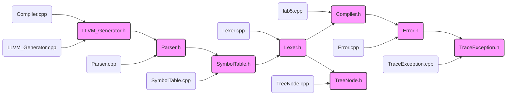
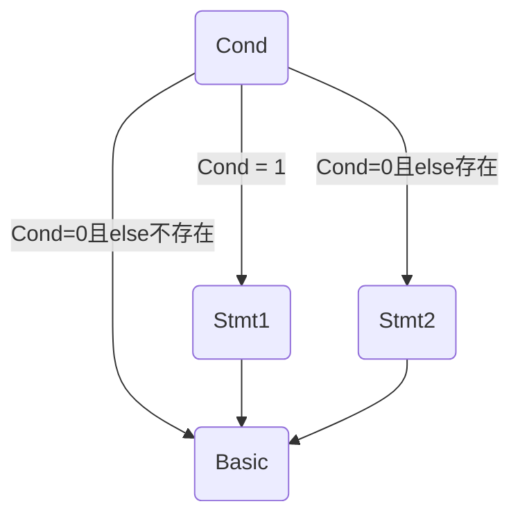
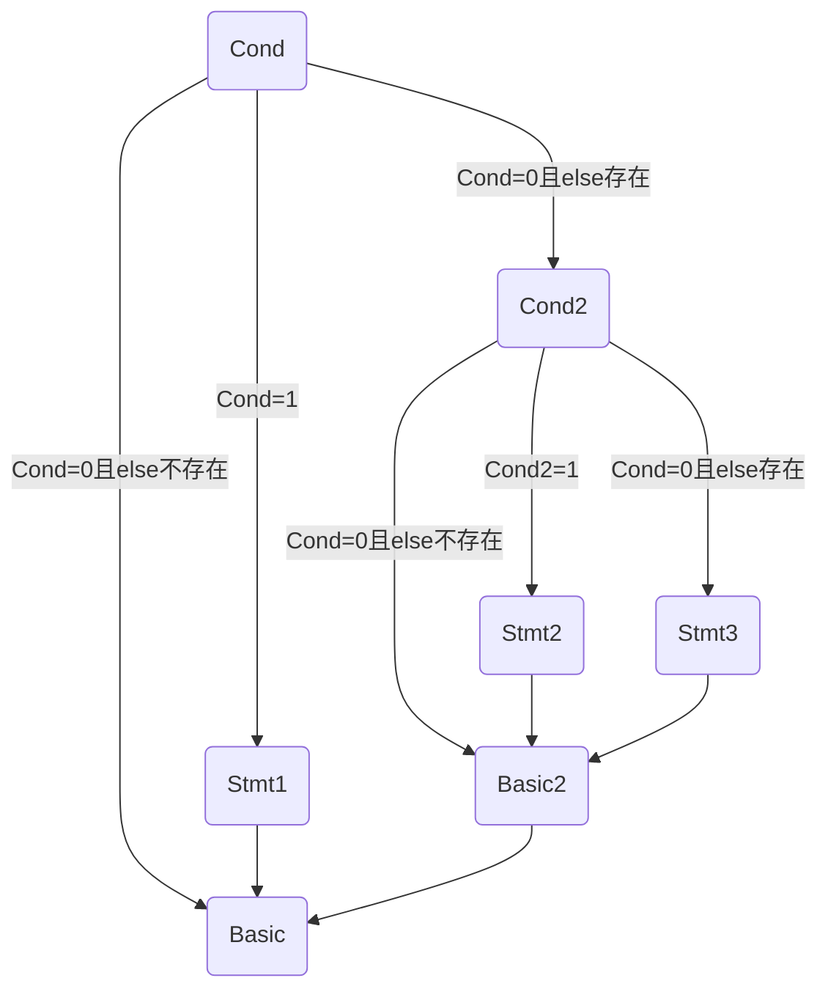
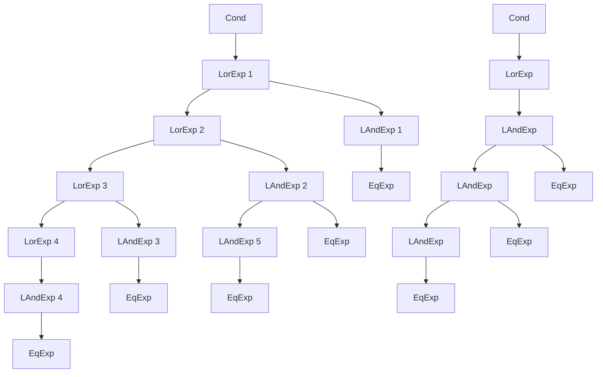

# llvm_compiler
>由 C++ 开发的 C 语言子集编译至 LLVM 中间代码编译器。
>
>文法详见：

[TOC]

## 总体设计

+ **编译器语言：**CPP
+ **目标代码语言**：LLVM

### 总体结构

本编译器总体架构呈现为

+ **词法分析独立进行**
  + 词法分析在运行时会填充一个单词列表 `vector<Word> wordlist` ，作为语法分析的输入。
+ **语法分析根据单词表单独进行生成语法树**
  + 语法分析在运行时读取词法分析生成的单词列表进行。在运行中生成一棵只包含语法节点的语法树，在结束后会再对该语法树进行填充单词。
+ **中间代码生成根据语法树独立进行**
  + 遍历语法分析生成的语法树进行LLVM代码生成。
+ **符号表填充在语法分析和中间代码生成中进行**
  + 在语法填充部分主要负责创建符号和符号表
  + 在中间代码生成部分负责存储对应符号的值和寄存器编号等内容
+ **错误处理在词法分析和语法分析中进行**
  + 词法分析中处理 "a" 型错误。
  + 语法分析中处理其他错误。
  + 在中间代码生成前会检验是否在前两个过程中有错误存在，若有则不再进行中间代码生成。

### 接口设计

只需要新建一个 `Compiler` 对象并调用对象的 `compile()` 方法，即可开始编译。

### 文件组成

#### 文件结构

```bash
|-- package
	|-- cpp
		|-- Compiler.cpp
		|-- Error.cpp
		|-- Lexer.cpp
		|-- LLVM_Generator.cpp
		|-- Parser.cpp
		|-- SymbolTable.cpp
		|-- TraceException.cpp
		|-- TreeNode.cpp
	|-- lib
		|-- Compiler.h
			|-- Compiler 类		#整体编译器类
		|-- Error.h
			|-- Error 类		#错误处理类
		|-- Lexer.h
			|-- Word 类		#单词类，继承自TreeNode 类
			|-- Lexer 类		#词法分析类
		|-- LLVM_Generator.h
			|-- Quadruple 类		#一个四元组类
			|-- LLVM_Generator 类		#LLVM代码生成类
		|-- Parser.h
			|-- Grammar 类		#语法类，继承自TreeNode 类
			|-- Parser 类		#语法分析类
		|-- SymbolTable.h
			|-- Symbol 类		#符号类
			|-- SymbolTable 类		#符号表类
		|-- TraceException.h
			|-- TraceException 类		#异常处理类
		|-- TreeNode.h
			|-- TreeNode 类		#节点类
	|-- lab5.cpp		#入口main函数
```

#### 文件依赖

为了避免头文件的循环依赖，用脚本生成了文件依赖图：



## 单元设计

### 词法分析

#### 编码前的设计

##### 思路概述

每次读入一行，然后循环读取字符：

+ 首先判断是否在多行注释中，如果是：
  + 若读取字符为 `*` ，则置 `flag` 为 True
  + 若读取字符为 `\` ，则观察 `flag` 
    + 为 True 则退出注释，置 `flag` 为 False ，读取下一个字符，重复步骤
    + 为 False 则读取下一个字符，重复步骤
  + 若为其他符号，置 `flag` 为 False ，读取下一个字符，重复步骤
+ 若读取字符为字母，进入 `analyse_word` 子程序：
  + 循环读取符合文法规则的字符，知道不符合文法规则或行结束
  + 与关键字字符匹配
  + 加入单词列表
  + 退出子程序，读取下一个字符，重复步骤
+ 若读取字符为数字，进入 `analyse_number` 子程序，读取下一个字符，重复步骤
+ 若读取字符为 `"` ，进入 `analyse_formatString` 子程序，读取下一个字符，重复步骤
+ 若读取字符为**空白字符**，如 `\t` 、 `\r` 等，取下一个字符，重复步骤
+ 若读取字符为其他字符，进入 `analyse_char` 子程序：
  + 若为 `\\` 则将返回 1 ，若为 `\*` 则将注释标记置 True 并返回 0 ，若为其他可识别字符则返回 0 ，若为不可识别字符则返回 2 
  + 返回 1 则退出本行循环，返回 0 则继续本行循环，返回 2 则转错误处理

##### 类设计

###### Word

|  名字  |  类型  | public/private |     说明     |
| :----: | :----: | :------------: | :----------: |
|  type  | string |     public     | 记录单词类型 |
| value  | string |     public     |  记录单词值  |
| Word() |        |     public     |   构造函数   |

###### Lexer

|          名字          |     类型      | public/private |                说明                 |
| :--------------------: | :-----------: | :------------: | :---------------------------------: |
|        wordlist        | vector<Word>  |     public     |     存储词法分析结果的单词列表      |
|       error_list       | vector<Error> |     public     |      存储可能的错误的错误列表       |
|      infile_path       |    string     |     public     |            输入文件路径             |
|      outfile_path      |    string     |     public     |            输出文件路径             |
|        Lexer()         |               |     public     |              构造函数               |
|     **analyse()**      |     void      |     public     |               主函数                |
|        compiler        |   Compiler*   |    private     |              编译器类               |
|         infile         |   ifstream    |    private     | 输入流，在**analyse()**方法开始打开 |
|        outfile         |   ofstream    |    private     | 输出流，在**analyse()**方法开始打开 |
|      push_word()       |     void      |    private     |      将单词添加到单词列表尾部       |
|     analyse_word()     |     void      |    private     |                                     |
|    analyse_number()    |     void      |    private     |                                     |
| analyse_formatString() |     void      |    private     |                                     |
|     analyse_char()     |      int      |    private     |                                     |

#### 编码后的修改

##### 类设计

考虑在错误处理中需要行号的数据，因此给 `Word` 和 `Lexer` 类都添加了相关字段。

###### Word

| 名字 | 类型 | public/private | 说明 |
| :--: | :--: | :------------: | :--: |
| line | int  |     public     | 行号 |

###### Lexer

|   名字   | 类型 | public/private |        说明        |
| :------: | :--: | :------------: | :----------------: |
| line_num | int  |    private     | 每次读取新行时 + 1 |

### 语法分析

#### 编码前的设计

##### 思路概述

使用递归对词法分析生成的单词列表进行分析，将生成的结果存储在数组中。

###### 难点设计

对左递归文法的处理：

一开始试图直接将文法展开处理，但是输出会存在问题。因此按照下述处理方案处理：每当读到一个符号（如 `+` ），则在列表前方在加一个非终结符，最终完美解决问题。

##### 类设计

###### Grammar

|   名字    |  类型  | public/private |         说明         |
| :-------: | :----: | :------------: | :------------------: |
| start_id  |  int   |     public     | 语法开始对应的单词id |
|  end_id   |  int   |     public     | 语法结束对应的单词id |
|   type    | string |     public     |       语法类型       |
| Grammar() |        |     public     |       构造函数       |

###### Parser

|          名字          |     类型      | public/private |            说明            |
| :--------------------: | :-----------: | :------------: | :------------------------: |
|       error_list       | vector<Error> |     public     | 存储词法分析结果的单词列表 |
|        compiler        |   Compiler*   |     public     |          编译器类          |
|         Parser         |               |     public     |          构造函数          |
|     **analyse()**      |     void      |     public     |       语法分析主函数       |
|         index          |      int      |    private     |     当前查看的单词序号     |
|          sym           |     Word      |    private     |       当前查看的单词       |
|        outfile         |   ofstream    |    private     | 输出流，在print开始时打开  |
|       nextsym()        |     void      |    private     |         下一个单词         |
|       lastsym()        |     void      |    private     |         上一个单词         |
|       fade_sym()       |     Word*     |    private     |          偷读单词          |
|        print()         |               |    private     |            输出            |
|   analyse_CompUnit()   |     void      |    private     |                            |
|     analyse_Decl()     |     void      |    private     |                            |
|  analyse_ConstDecl()   |     void      |    private     |                            |
|    analyse_BType()     |     void      |    private     |                            |
|   analyse_ConstDef()   |     void      |    private     |                            |
| analyse_ConstInitVal() |     void      |    private     |                            |
|   analyse_VarDecl()    |     void      |    private     |                            |
|    analyse_VarDef()    |     void      |    private     |                            |
|   analyse_InitVal()    |     void      |    private     |                            |
|   analyse_FuncDef()    |     void      |    private     |                            |
| analyse_MainFuncDef()  |     void      |    private     |                            |
|   analyse_FuncType()   |     void      |    private     |                            |
| analyse_FuncFParams()  |     void      |    private     |                            |
|  analyse_FuncFParam()  |     void      |    private     |                            |
|    analyse_Block()     |     void      |    private     |                            |
|  analyse_BlockItem()   |     void      |    private     |                            |
|     analyse_Stmt()     |     void      |    private     |                            |
|   analyse_Stmt_for()   |     void      |    private     |                            |
| analyse_Stmt_idenfr()  |     void      |    private     |                            |
|   analyse_ForStmt()    |     void      |    private     |                            |
|     analyse_Exp()      |     void      |    private     |                            |
|     analyse_Cond()     |     void      |    private     |                            |
|     analyse_LVal()     |     void      |    private     |                            |
|  analyse_PrimaryExp()  |     void      |    private     |                            |
|    analyse_Number()    |     void      |    private     |                            |
|   analyse_UnaryExp()   |     void      |    private     |                            |
|   analyse_UnaryOp()    |     void      |    private     |                            |
| analyse_FuncRParams()  |     void      |    private     |                            |
|    analyse_MulExp()    |     void      |    private     |                            |
|    analyse_AddExp()    |     void      |    private     |                            |
|    analyse_RelExp()    |     void      |    private     |                            |
|    analyse_EqExp()     |     void      |    private     |                            |
|   analyse_LAndExp()    |     void      |    private     |                            |
|    analyse_LOrExp()    |     void      |    private     |                            |
|   analyse_ConstExp()   |     void      |    private     |                            |


#### 编码后的修改

##### 思路概述

首先是在编码过程中，经常遇到问题无法解决，因此新增加了 `TraceException` 类，便于捕捉到异常的具体位置。

考虑到后续需要对语法树进行处理，因此首先是丰富了 `Gammer` 类的成员变量，并更改了 `Parser` 类的部分方法，最终建成了一个只有非终结符的语法树。其中，左递归文法的处理如下：

```bash
# 以1+2+3+4为例

# step 1 ： 读入 1
FatherNode
	|-- AddExp1
		|-- MulExp1
			|-- ...
				|-- 1

# step 2 ： 读入 + 2
# 为 AddExp1 加入添加父节点AddExp2   并添加AddExp1的兄弟节点MulExp2
FatherNode
	|-- AddExp2
        |-- AddExp1
            |-- MulExp1
                |-- ...
                    |-- 1
        |-- MulExp2
        	|-- ...
        		|-- 2
        		
        		
# step 3 : 与step2类似 读入 + 3 
# 为 AddExp2 加入添加父节点AddExp3   并添加AddExp2的兄弟节点MulExp3
# ...
```

考虑到希望有一棵同时有终结符和非终结符的树，因此新增加了 `TreeNode` 类， 终结符`Word` 类和非终结符 `Grammar` 类都继承自此类。并在正常语法分析结束后对结合只有 `Gammar` 的语法树对 `TreeNode` 语法树进行填充。思路如下：

非终结符转移情况：

1. 进入子节点
2. 进入父节点
3. 进入兄弟节点

对应的终结符处理：

1. 进入子结点时
   + 父节点到子节点的终结符
2. 进入父节点时
   + 子节点到父节点间的终结符
3. 进入兄弟节点
   + 兄弟节点间的终结符
4. 进入节点后
   + 无子节点 加入终结符

##### 类设计

###### Parser

|             名字             |   类型    | public/private |                  说明                  |
| :--------------------------: | :-------: | :------------: | :------------------------------------: |
|         grammar_tree         | Grammar*  |     public     |          只有非终结符的语法树          |
|      grammar_tree_root       | TreeNode* |     public     |                 语法树                 |
|    create_grammar_node()     |   void    |    private     |             创建语法树节点             |
|    update_grammar_node()     |   void    |    private     |             更新语法树节点             |
| create_grammar_parent_node() |   void    |    private     |               新建父节点               |
|    preorder_build_tree()     |   void    |    private     | 前序遍历只有非终结符的语法树创建语法树 |
|      preorder_print2()       |   void    |    private     |              前序遍历输出              |

###### Grammar

|    名字    |       类型       | public/private |    说明    |
| :--------: | :--------------: | :------------: | :--------: |
|   parent   |     Grammar*     |     public     |   父节点   |
| child_list | vector<Grammar*> |     public     | 子节点列表 |

###### TreeNode

|      名字       |       类型        | public/private |    说明    |
| :-------------: | :---------------: | :------------: | :--------: |
|    node_type    |        int        |     public     |  节点类型  |
| child_node_list | vector<TreeNode*> |     public     | 子节点列表 |

### 错误处理

#### 编码前的设计

##### 思路概述

错误处理在词法分析和语法分析中同时进行，并且由于错误处理设计部分语义问题，因此必须在语法分析的同时填充单词表。

##### 类设计

###### Symbol

|         名字         |     类型     | public/private |               说明               |
| :------------------: | :----------: | :------------: | :------------------------------: |
|         word         |    Word*     |     public     |           符号对应单词           |
|     parent_table     | SymbolTable* |     public     |               父表               |
|      self_table      | SymbolTable* |     public     | 若为函数符号则将指向自身的符号表 |
|         type         |     int      |     public     |             符号类型             |
|         con          |     int      |     public     |         是否为常量或参数         |
|        value         |     int      |     public     |                值                |
|   func_param_type    | vector<int>  |     public     |           函数参数类型           |
| func_param_dimension | vector<int>  |     public     |           函数参数维度           |
|       Symbol()       |              |     public     |             构造函数             |

###### SymbolTable

|       名字       |         类型         | public/private |        说明        |
| :--------------: | :------------------: | :------------: | :----------------: |
|      level       |         int          |     public     |     符号表等级     |
|   return_flag    |         int          |     public     |    是否有返回值    |
|       name       |        string        |     public     |      符号表名      |
|   parent_table   |     SymbolTable*     |     public     |        父表        |
|    symbol_map    | map<string, Symbol>  |     public     |     表中的符号     |
| child_table_list | vector<SymbolTable*> |     public     |        子表        |
|  SymbolTable()   |                      |     public     |      构造函数      |
|     print()      |         void         |     public     |     输出符号表     |
|   isInTable()    |         bool         |     public     | 检查符号是否在表中 |

###### Parser

|         名字         |     类型     | public/private |        说明        |
| :------------------: | :----------: | :------------: | :----------------: |
|    current_table     | SymbolTable* |    private     |     当前符号表     |
|    current_symbol    |    Symbol    |    private     |      当前符号      |
| temp_current_symbol  |    Symbol    |    private     |                    |
|  temp_current_line   |     int      |    private     |                    |
|    check_symbol()    |     void     |    private     |  检查符号是否存在  |
| check_const_symbol() |     void     |    private     | 检查符号是否为常量 |
|  get_return_type()   |     int      |    private     |   获得返回值类型   |
|    push_symbol()     |     void     |    private     |  将符号加入符号表  |

###### Error

|    名字     |  类型  | public/private |   说明   |
| :---------: | :----: | :------------: | :------: |
|    line     |  int   |     public     |   行号   |
|    code     | string |     public     | 错误代码 |
|    type     | string |     public     |   类型   |
| explanation | string |     public     | 错误原因 |
|   Error()   |        |     public     | 构造函数 |

#### 编码后的修改

##### 思路概述

当需要检查函数参数类型时，可能会再调用其他函数，此时之前读取的参数类型数组可能发生变化。因此要在分析完某一个参数后重新获取参数列表。

由于词法分析和语法分析分步进行错误处理，因此所有错误要将两个列表合并后进行排序处理。

### 代码生成

#### 编码前的设计

##### 思路概述

遍历语法树，逐语句生成中间代码。

其中跳转部分我写了一篇博客 [跳转部分](https://cx330-502.github.io/2023/11/11/2023-11/2023-11-11-llvm%E4%B8%AD%E9%97%B4%E4%BB%A3%E7%A0%81%E7%94%9F%E6%88%90-%E8%B7%B3%E8%BD%AC/)

具体内容如下：

跳转感觉是整个 LLVM 中间代码生成中最难的一部分了，总共三个小部分 `if` 跳转、`cond` 跳转、 `for` 跳转，其中又以 `cond` 跳转最难，接下来按照顺序分析每个部分。

###### if 跳转

在 SysY 中，`if` 语句文法如下：

```shell
'if' '(' Cond ')' Stmt [ 'else' Stmt ]
```

用图表表示如下：



也就是这里的跳转有如下几种情况：

+ `if` 条件为真时，跳转到 `Stmt1`
+ `if` 条件为假且 `else` 存在时，跳转到 `Stmt2`
+ `if` 条件为假且 `else` 不存在时，跳转到 `Basic` （即下一条正常语句）
+ `Stmt2` 执行结束跳转到 `Basic` 
+ `Stmt1` 执行结束跳转到 `Basic` 

从跳转的目标来看，这里需要三个 `label` 分别指向  `Stmt1` 、 `Stmt2` 、 `Basic` 。

这里出现了第一个**坑**，如果在前面的代码生成中都使用了数字作为虚拟寄存器代号，那么我**强烈建议**改成用字符串编号。为什么呢？

在按照顺序对 `if` 语句进行代码生成时，按照有 `else` 的情况，那么就需要在 `Stmt1` 的结尾和 `Stmt2` 的结尾分别跳转到 `Basic` 块。

+ 如果等 `Stmt1` 和 `Stmt2` 完全生成结束了才开始开始对 `Basic` 开始编号，那么 `Stmt1` 的结尾和 `Stmt2` 的结尾处的跳转语句就无从处理
+ 而如果先决定下来了 `Basic` 的编号，按照虚拟寄存器数字代号的要求，label 的顺序必须按照数字的顺序，也就是说很可能需要先生成 `Basic` 块的代码，再去处理 `Stmt1` 和 `Stmt2` ，这显然过于繁琐。

因此**强烈建议**改成用字符串编号，其实很好改，在编号前面加个字母就好了（doge）。

至于 `if` 跳转的代码怎么生成，其实是非常简单的，按照源代码按顺序生成 LLVM 代码即可：

```cpp
int stmt1_label = curReg++;
int stmt2_label = curReg++;
int basic_label = curReg++;
if(存在else){
    cout<<br i1 %cond label stmt1_label, label stmt2_label<<endl；
}else{
    cout<<br i1 %cond label stmt1_label, label basic_label<<endl；
}
//处理Stmt1
cout<<endl<<stmt1_label:<<endl；
generate_stmt1;
cout<<br label basic_label<<endl;
//处理else
if(存在else){
	cout<<endl<<stmt2_label:<<endl；
	generate_stmt2;
	cout<<br label basic_label<<endl;
}

cout<<endl<<basic_label:<<endl
//生成接下来的代码
```

当然啦，可能会有人疑惑，这不是只解决了一层的 `if` 吗，多层嵌套呢？

其实是一样的~~~



跳转到 `Basic` 的语句最终会被添加到 `Basic2` 的末尾，而跳转到 `Basic2` 的语句则会根据之前的程序被添加到每个分支的末尾。

因此，上面的伪代码就已经很好的解决了 `if` 所有的跳转问题，但是难点短路求值还没开始呢😏😏😏。

###### 短路求值

**基本**

上面并没有直接的讨论 `if` 的判断条件 `Cond` 。事实上，根据语法树对 `Cond` 求值并不难，甚至和常量表达式一样非常简单，但是烦就烦在短路求值：

```cpp
int num = 0;
if ( 1 || num++){
    std::cout<< num << std::endl;
}
```

此处输出的 `num` 值是多少呢？但凡有点基础的都知道是 0 ，因为当条件语句的一部分已经能够确定整体值的时候，就不会再去计算剩下的部分。

从理论上来说，这个短路求值的操作是为了提升性能，毕竟能少算一部分。~~那么从理论上来说，我不要这部分性能直接全算不就行了嘛。怎么会有人在条件语句里改变值啊淦~~

所以，出于我们提高性能的伟大目的，让我们来看一看这个短路求值。

首先，短路求值的跳转目标是什么呢？

并不是直接跳转回去赋值，而是**直接跳转进入对应的基本块**。

例如上述代码，条件语句检测到 1 后，应该是跳转直接执行输出语句，而不是先跳转到 `Cond` 语法树的顶端，将它赋值为 1 后再进行判断再跳转。

那么，我们应该如何在分析 `Cond` 的函数中用到之前 `if` 语句的 label 编号呢，第一种方法是函数传值，但是这样很有可能需要改写很多之前写完的函数，我懒得再改了；第二种方法就是用全局变量，把这三个 label 都存起来，只要需要用随时可以读取。

了解了跳转目标后，我们再来看一下 `Cond` 相关的文法：

```shell
Cond    → LOrExp
LOrExp  → LAndExp | LOrExp '||' LAndExp 
LAndExp → EqExp | LAndExp '&&' EqExp
EqExp   → RelExp | EqExp ('==' | '!=') RelExp
RelExp  → AddExp | RelExp ('<' | '>' | '<=' | '>=') AddExp
```

事实上所有的跳转必然发生在 `LOrExp` 和 `LAndExp` 节点的子节点计算完成后。我们先画出这文法的语法树：



这两个语法树中就已经包含了前三条文法的几乎所有情况。

首先来看左边的这棵语法树，

可以看到，所有的 `LOrExp` 都出现在左节点，基于或运算的特性，我们得到了短路求值中的第一种跳转：任一 `LOrExp` 为 True 后即可直接跳转至 `if` 语句的 `Stmt1` 语句。

同样基于或运算的特性，第二种跳转为：任一父节点为 `LOrExp` 的 `LAndExp` 节点为 True 后即可直接跳转至 `if` 语句的 `Stmt1` 语句。

基于前两条跳转，我们得到第三种跳转，任一 `LAndExp` 节点若为 false ，则可直接跳转至与之最接近的父 ` LOrExp` 节点的父节点并进入其右子树。

这就是左边这种语法树的所有跳转情况：

+ 任一 `LOrExp` 为 True 后即可直接跳转至 `if` 语句的 `Stmt1` 语句。
+ 任一父节点为 `LOrExp` 的 `LAndExp` 节点为 True 后即可直接跳转至 `if` 语句的 `Stmt1` 语句。
+ 任一 `LAndExp` 节点若为 false ，则可直接跳转至与之最接近的父 ` LOrExp` 节点的父节点并进入其右子树。

第三种情况这么说可能很抽象啊，我们来结合图像讲一下，比如说 `LAndExp 5` 这个节点，首先如果程序进入了这个节点，那么我们就可以确定 `LOrExp 5` 及其子树必然是 false ， `LOrExp 2` 的值只由 `LAndExp 2` 决定。

若 `LAndExp 5` 为 false ，那么基于与运算的特性， `LAndExp 2` 必为 false， `LOrExp 2` 也如此，那么我们就可以直接去处理 `LOrExp 1` 的右子树了。

所以 `LOrExp 1` 就是与 `LAndExp 5` 最接近的父 ` LOrExp` 节点的父节点。

那么怎么跳到这个位置呢？

首先需要明确一点，我们已经覆盖了左边语法树的所有跳转情况，除去直接跳转出 `Cond` 的两种，跳转目标其实是所有 `LOrExp` 节点的右子树（除了 `LOrExp4` 这种只有一个子节点的）

要存下这么多的跳转目标，最好的结构自然是栈，伪代码如下：

```cpp
// 以下是对 LOrExp 节点的分析
int LorExp_label = curReg++;
stack.push(LorExp_label);
generate_左子树();//生成左子树相关的中间代码
//如果左子树为1，则直接跳转到Stmt1
cout << br i1 左子树.value label Stmt1,  label LorExp_label << endl;
cout << LorExp_label: << endl;
generate_右子树();//生成右子树相关的中间代码
stack.pop();
//如果右子树为1，则直接跳转到Stmt1
//如果右子树为0，则直接跳转到父节点的右子树（LOrExp节点不可能为左子树）
cout << br i1 右子树.value label Stmt1,  label stack.top() << endl;
return_to_父节点；
```

可能已经有人发现了问题，**与当前节点最接近的父 ` LOrExp` 节点的父节点**，那么如果是 `LAndExp 1` 呢？它父节点的父节点可就是 `Cond` 了，这怎么跳转？

实际上 `LAndExp 1` 这边的子树一旦值为 flase ， 则将立刻跳转进入 `if` 语句的 `Stmt2` 语句或 `Basic` 语句，那么在程序中如何实现呢？其实只要在进入 `Cond` 时将 `Stmt2` 语句或 `Basic` 语句压入其中即可， `LAndExp 1` 这边的子树一旦值为 flase ，则栈中父节点的父节点对应的 label 即为 `Stmt2` 语句或 `Basic` 语句。

从数据结构的角度来说则是， `Stmt2` 语句或 `Basic` 语句始终在栈底。在本程序中，我们需要寻找的不是栈顶元素，而是第二高的栈顶元素，当在左子树时，栈内元素必然大于等于三（ `Stmt2` 语句或 `Basic` 语句、LorExp 1 、LorExp 2），正常存取即可；而一旦进入右子树，栈内元素数量必然等于2，此时一旦出现 false ，则将取栈内第二高的元素，即为 `Stmt2` 语句或 `Basic` 语句。

因此对 `LAndExp` 节点，伪代码如下：

```cpp
generate_左子树();//生成左子树相关的中间代码
int temp = stack.top();
stack.pop();//不需要直接父 LOrExp节点
cout<<br i1 左子树.value label LAndExp, label stack.top()<<endl;
stack.push(temp);
cout<<LAndExp:<<endl;
generate_右子树();
return_to_父节点；
```

对于右边的子树，其实它完美符合左子树的第三条规则，就不再赘述了😏😏😏

###### 坑

在短路求值中一个比较坑的点时， `br` 条件跳转后面接的值类型为 `i1` ，而 `RelExp` 中可能有 `i32` 的值。由于所有的跳转都发生在 `LAndExp` 和 `LOrExp` 两种，因此我们要保证值从 `EqExp` 返回到 `LAndExp` 时为 `i1` 。

这里懒得画语法树了，直接看文法吧：

```shell
EqExp   → RelExp | EqExp ('==' | '!=') RelExp
RelExp  → AddExp | RelExp ('<' | '>' | '<=' | '>=') AddExp
```

首先，对于 `RelExp` ，它的值有两种可能 `i1` 和 `i32` ，其实很好区分，只有一个子节点的是 `i32` ，有两个子节点（只考虑非终结符）的是 `i1` ，但是又可能有 ` 1 < 3 > 1 ` 这种鬼畜表达式，从语法树上来看，先计算 `1 < 3` 得到 `i1` 的 1 ，接下来应该把 `i1` 升为 `i32` ，再计算 `1 > 3 ` 得到 `i1` 的 0 。

所以我们得出结论，对于有两个子节点的 `RelExp` 应当先将 `i1` 升为 `i32` 再向上传递。

这样，我们就能保证 `EqExp` 的子节点 `RelExp` 必为 `i32`。接下来与 `RelExp` 类似，但需要注意的是，转换 `EqExp` 类型前应先检查其父节点的类型，若为 `EqExp` 则应该转化为 `i32` ，若为 `LAndExp` 则应该转化为 `i1` 。

##### 类设计

###### Symbol

|        名字         |    类型     | public/private |      说明      |
| :-----------------: | :---------: | :------------: | :------------: |
|       reg_num       |     int     |     public     |   寄存器编号   |
|     dimension_1     |     int     |     public     |   第一维上界   |
|     dimension_2     |     int     |     public     |   第二维上界   |
| current_dimension_1 |     int     |     public     |                |
| current_dimension_2 |     int     |     public     |                |
|        alive        |    bool     |     public     | 变量是否已唤醒 |
|     value_list      | vector<int> |     public     |   常数组的值   |
|       wake()        |    void     |     public     |    唤醒符号    |
|      isConst()      |    bool     |     public     | 符号是否为常量 |
|     isGlobal()      |    bool     |     public     |  符号是否全局  |
|   update_value()    |    void     |     public     |     更新值     |
|  update_reg_num()   |    void     |     public     |   更新寄存器   |
|      get_reg()      |   string    |     public     |   获取寄存器   |
|  get_const_value()  |     int     |     public     |     获取值     |

###### SymbolTable

|        名字        |  类型   | public/private |     说明     |
| :----------------: | :-----: | :------------: | :----------: |
| get_func_symbol()  | Symbol* |     public     | 获取函数符号 |
|    get_symbol()    | Symbol* |     public     |   获取符号   |
| get_waked_symbol() | Symbol* |     public     | 获取唤醒符号 |

###### TreeNode

|      名字       |  类型  | public/private |       说明        |
| :-------------: | :----: | :------------: | :---------------: |
|     reg_num     |  int   |     public     |    寄存器编号     |
|      value      |  int   |     public     |        值         |
|   value_type    |  int   |     public     |      值类型       |
|    isAddress    |  bool  |     public     |    是否为地址     |
|  setAddress()   |  void  |     public     | 设置为地址/非地址 |
| get_str_value() | string |     public     | 获取字符串类型值  |
| get_int_value() |  int   |     public     |    获取int型值    |
|  update_reg()   |  void  |     public     |    更新寄存器     |
| update_value()  |  void  |     public     |      更新值       |

###### Quadruple

|       名字       |  类型  | public/private |    说明    |
| :--------------: | :----: | :------------: | :--------: |
|      value1      |  int   |     public     |   第一值   |
|      value2      |  int   |     public     |   第二值   |
|      value3      |  int   |     public     |   第三值   |
|      value4      |  int   |     public     |   第四值   |
|    Quadruple     |        |     public     |  构造函数  |
|   get_value1()   | string |     public     | 获取第一值 |
|   get_value2()   | string |     public     | 获取第二值 |
|   get_value3()   | string |     public     | 获取第三值 |
|   get_value4()   | string |     public     | 获取第四值 |
| get_false_jump() | string |     public     |            |

###### LLVM_Generator

|          名字           |       类型        | public/private |                  说明                  |
| :---------------------: | :---------------: | :------------: | :------------------------------------: |
|        compiler         |     Compiler*     |     public     |                编译器类                |
|    LLVM_Generator()     |                   |     public     |                构造函数                |
|     **generate()**      |       void        |     public     |                 主函数                 |
|         outfile         |     ofstream      |    private     | 输出流，在**generate()**函数开始时打开 |
|       file_output       |       bool        |    private     |             是否在文件输出             |
|      local_output       |       bool        |    private     |            是否在控制台输出            |
|         curNode         |     TreeNode*     |    private     |                当前节点                |
|         curReg          |        int        |    private     |              下一个寄存器              |
|      decling_name       |      string       |    private     |                                        |
|        curTable         |   SymbolTable*    |    private     |               当前符号表               |
|      childTableNum      |    stack<int>     |    private     |               子符号表数               |
|         ifStack         | stack<Quadruple*> |    private     |             处理if语句的栈             |
|        condStack        |    stack<int>     |    private     |              处理跳转的栈              |
|        forStack         | stack<Quadruple*> |    private     |              处理循环的栈              |
|       isGlobal()        |       bool        |    private     |           当前符号表是否全局           |
| step_into_child_table() |       void        |    private     |                进入子表                |
| step_out_child_table()  |       void        |    private     |                离开子表                |
|   generate_compUnit()   |       void        |    private     |                                        |
|     generate_lib()      |       void        |    private     |                                        |
|     generate_decl()     |       void        |    private     |                                        |
|  generate_constDecl()   |       void        |    private     |                                        |
|   generate_constDef()   |       void        |    private     |                                        |
| generate_constInitVal() |       void        |    private     |                                        |
|   generate_constExp()   |       void        |    private     |                                        |
|   generate_varDecl()    |       void        |    private     |                                        |
|    generate_varDef()    |       void        |    private     |                                        |
|   generate_initVal()    |       void        |    private     |                                        |
|   generate_funcDef()    |       void        |    private     |                                        |
| generate_funcFParams()  |       void        |    private     |                                        |
|   generate_mainFunc()   |       void        |    private     |                                        |
|    generate_block()     |       void        |    private     |                                        |
|  generate_blockItem()   |       void        |    private     |                                        |
|     generate_stmt()     |       void        |    private     |                                        |
|  generate_returnStmt()  |       void        |    private     |                                        |
|  generate_assignStmt()  |       void        |    private     |                                        |
|  generate_getintStmt()  |       void        |    private     |                                        |
|  generate_printfStmt()  |       void        |    private     |                                        |
|    generate_ifStmt()    |       void        |    private     |                                        |
|   generate_forStmt()    |       void        |    private     |                                        |
|     generate_exp()      |       void        |    private     |                                        |
|    generate_addExp()    |       void        |    private     |                                        |
|    generate_mulExp()    |       void        |    private     |                                        |
|   generate_unaryExp()   |       void        |    private     |                                        |
|  generate_primaryExp()  |       void        |    private     |                                        |
|     generate_cond()     |       void        |    private     |                                        |
|    generate_relExp()    |       void        |    private     |                                        |
|    generate_eqExp()     |       void        |    private     |                                        |
|   generate_lAndExp()    |       void        |    private     |                                        |
|    generate_lOrExp()    |       void        |    private     |                                        |
|    generate_number()    |       void        |    private     |                                        |
|     generate_lval()     |       void        |    private     |                                        |
| generate_funcRParams()  |       void        |    private     |                                        |

#### 编码后的修改

##### 思路概述

由于错误处理会影响代码生成，因此语法分析结束后增加判断

```c++
if (!this->error_list.empty()) return 1;
```

如果存在错误则不进行代码生成。
