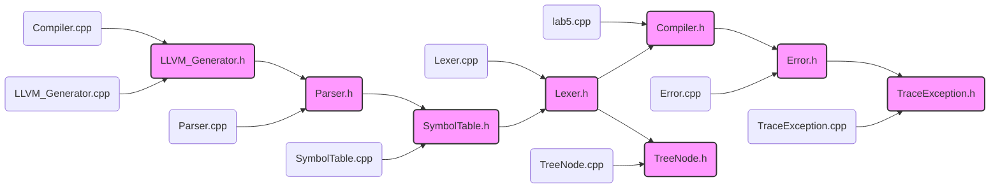

# C++ Dependency

```mermaid
graph LR
classDef hClass fill:#f9f,stroke:#333,stroke-width:2px;

CPP1(lab5.cpp); 
CPP2(Compiler.cpp); 	H2(Compiler.h):::hClass; 
CPP3(Error.cpp); 	H3(Error.h):::hClass; 
CPP4(Lexer.cpp); 	H4(Lexer.h):::hClass; 
CPP5(LLVM_Generator.cpp); 	H5(LLVM_Generator.h):::hClass; 
CPP6(Parser.cpp); 	H6(Parser.h):::hClass; 
CPP7(SymbolTable.cpp); 	H7(SymbolTable.h):::hClass; 
CPP8(TraceException.cpp); 	H8(TraceException.h):::hClass; 
CPP9(TreeNode.cpp); 	H9(TreeNode.h):::hClass; CPP1-->H2 ; 
CPP2-->H5 ; 
H2-->H3 ; 
CPP3-->H3 ; 
H3-->H8 ; 
CPP4-->H4 ; 
H4-->H2 ; H4-->H9 ; 
CPP5-->H5 ; 
H5-->H6 ; 
CPP6-->H6 ; 
H6-->H7 ; 
CPP7-->H7 ; 
H7-->H4 ; 
CPP8-->H8 ; 

CPP9-->H9 ; 

```